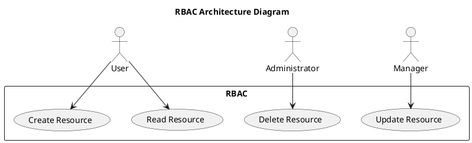

# Role Hierarchy Diagrams

## Role Hierarchy for the RBAC System
- **Administrator**
  - Responsible for overseeing the entire system.
  - Can create, read, update, and delete any resources.

- **Manager**
  - Oversees specific areas or departments.
  - Can create and update resources within their scope but has limited delete permissions.

- **User**
  - Can read resources relevant to their role.
  - Limited ability to create or update resources.

# Validation Flow Examples

1. **User Authentication**  
    - User enters credentials.  
    - System validates credentials against the database.  
    - If valid, user is granted access.

2. **Role Assignment**  
    - Upon successful login, the user retrieves their role from the database.  
    - System displays appropriate resources based on user role.

# PlantUML Architecture Diagram

